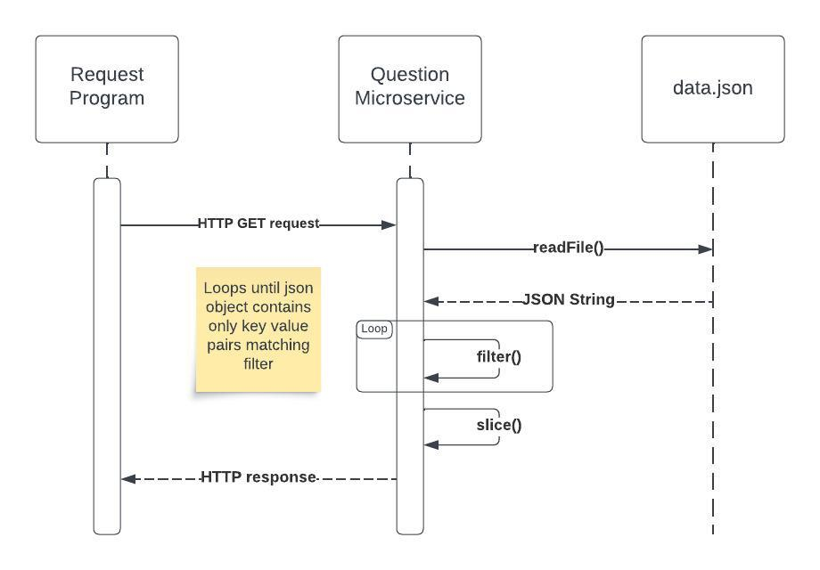

# Introduction
Questions Microservice is a program made for the purposes of CS361 in order to serve questions from a local database.

**Users can quickly get started by running "node index.js" in the project directory. Node.js must be installed on the user's system. Furthermore, please read the section under Basics**. Further information on features, while are not necessary, can be found under More Info.

# Basics

## Requesting Data
Requesting data involves making a HTTP GET request to your local machine on **port 3000**. Header information isn't necessary, since as of v1.0.0 only GET requests are supported. 

Example call in javascript with the Fetch API

```js
const response = await fetch('http://localhost:3000');
```

## Receiving Data
A response object is returned from a successive request call. The body member variable contains the raw JSON. Ihis isn't useful on its own without being parsed back into an object first.

A full example call in javacsript might look like:
```js
const logData = async () => {
  const response = await fetch('http://localhost:3000');
  const data = await response.json();
  console.log(data);
}
```
# More Info

## Querying
The Question Microservice makes use of URL querying to provide pagination and subject filtering.

Simply provide a limit, offset, subject (case insensitive), or any combination of the three.

### Examples

```
"http://localhost:3000/?limit=5"
```
>Limiting the amount of questions returned to 5
Querying for only Science questions and limiting results to 1 

```
"http://localhost:3000/?limit=1&subject=science"
```
>Limiting the amount of questions returned to 5

## UML Diagram

